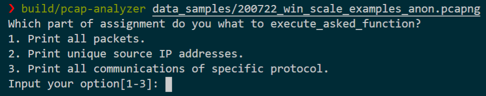
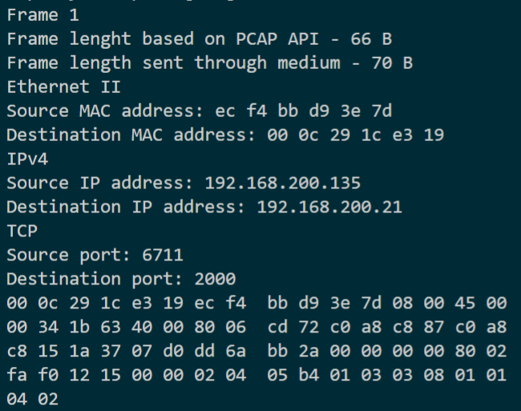
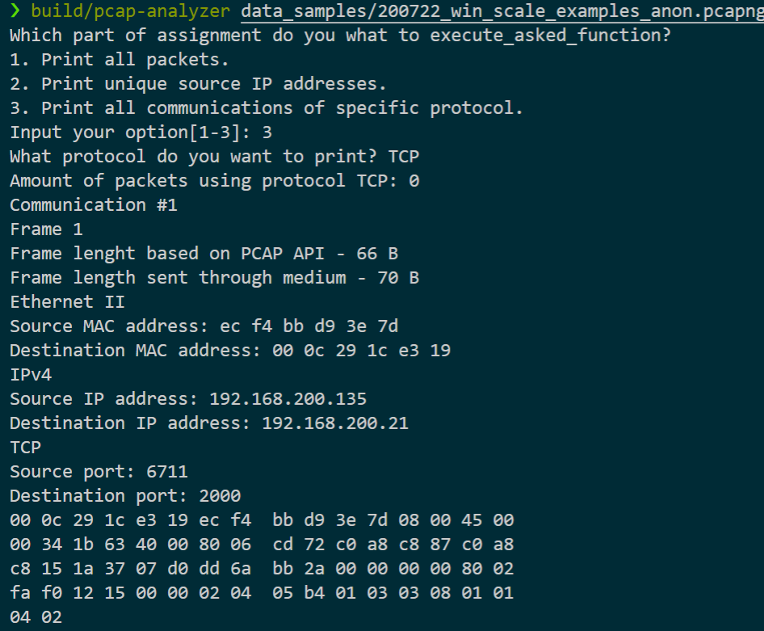

# pcap-analyzer
It's a simple program for PCAP content analysis. It creates a report in the standard output or inside a specified file.   

## Demo
At the start, the program asks the user for standard input. There are more possibilities for what the program can execute. 


In this example output, the program prints out all information it collects about the packets such as frame lengths, Ethernet standards, IP and MAC addresses, and protocols used.  


The second feature is finding unique addresses that are transmitting packets in the traffic. It uses a hashmap to store unique addresses and prints out the most frequent ones. 


There is also an option for basic filtering of communications based on their protocols. You input the name of the protocol (for example TCP) and the filter will print only traffic that uses TCP. It doesn't print them in packet order but in order of communication initialization.  


## Instalation
This application works on Linux systems. It uses pcap.h library so to use it, you need to install libpcap library:
```
sudo apt-get update && sudo apt-get install libpcap-dev
```
After cloning this repository you can install it using:
```
mkdir build 
cd build
cmake ..
cmake --build .
```
After successful installation, there should be a `pcap-analyzer` executable file. 

You can try to use it on any PCAP file. There are few PCAP examples in `data_samples/`. Simply type:
```
cd ..
build/pcap-analyzer data_samples/udp_lite_full_coverage_0.pcap first_output.txt
``` 
After execution, it will store the results inside the `first_output.txt`. If the second argument is not specified, it will print the output to the console.
